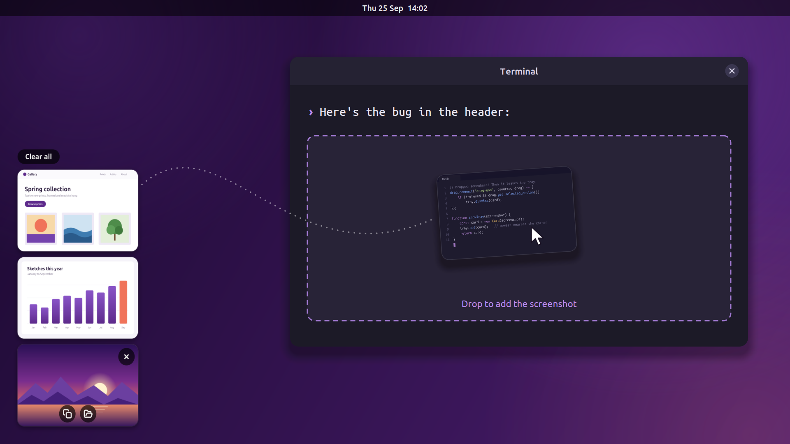
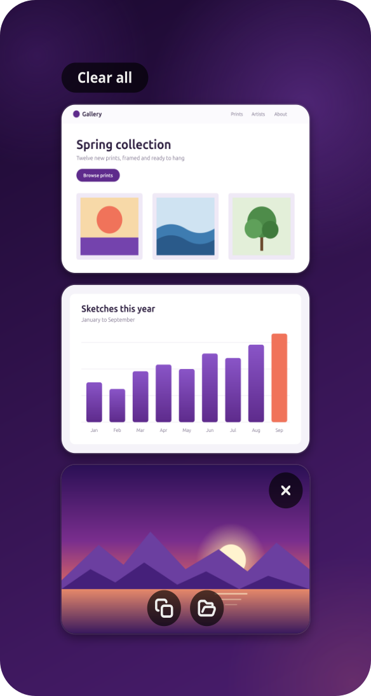
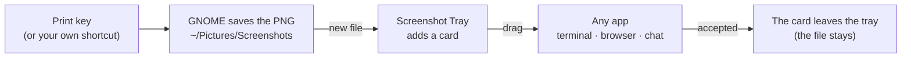
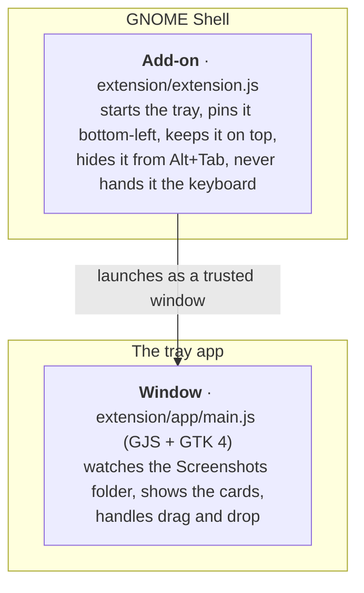

<p align="center">
  
</p>

<h1 align="center">Screenshot Tray</h1>

<p align="center">
  <b>Your latest screenshots float in the corner of the screen, ready to drag into any app.</b><br>
  The CleanShot-style floating stack, for Ubuntu and GNOME.
</p>

<p align="center">
  
</p>

## Why

On a Mac, [CleanShot X](https://cleanshot.com) keeps each new screenshot floating in a corner
of the screen, so you can drag it straight into a chat, an email or a coding assistant.
Ubuntu takes good screenshots too, but afterwards it only shows a short notice, and you have
to dig the file out of *Pictures → Screenshots*.

Screenshot Tray adds the missing piece: a small stack of your latest screenshots, above your
windows, one drag away from any app. It keeps using GNOME's own screenshot tool and only adds
the tray.

## Features

- **Floating stack.** Each new screenshot appears in the bottom-left corner, above your
  windows. The 5 newest are kept.
- **Drag into any app.** A terminal gets the file's path, which suits Claude Code and other
  coding assistants. Browsers, chats and email get the file itself.
- **Tidies itself.** Once an app accepts a dropped screenshot, its card leaves the tray.
  Hover a card for **Copy**, **Open** and **✕**, or press **Clear all**. When the tray is
  empty it hides.
- **Doesn't interrupt your typing.** It appears without taking the keyboard, and stays out of
  Alt+Tab and the dock.
- **Sharp on HiDPI screens.** Thumbnails are drawn with twice the pixels, so they stay crisp
  at 150 % and 200 % scaling.
- **Never deletes anything.** Your screenshots stay in *Pictures → Screenshots*; the tray only
  shows them.
- **Small and easy to check.** About 700 lines of JavaScript (GJS and GTK 4). It makes no
  network connections and needs no `sudo`.

<p align="center">
  
</p>

## How it works



Two small parts work together, following the recipe Ubuntu's own desktop icons use:



Why is there an add-on at all? On Wayland, GNOME doesn't let apps place their own windows or
keep them on top; only the desktop itself can. The add-on is that tiny piece of desktop, and
everything else is an ordinary GTK app.

## Install

Screenshot Tray needs **Ubuntu 26.04 (GNOME 50, Wayland)**. It has only been tested there;
other systems running GNOME 50 will probably work.

```bash
git clone https://github.com/romanlucian/screenshot-tray.git
cd screenshot-tray
./install.sh
```

Then **log out and back in once**, because GNOME loads new add-ons at login. After that the
tray starts by itself.

Tip: to paste a screenshot into Claude Code in a terminal with **Ctrl+V** (instead of
dragging it), install the clipboard helper with `sudo apt install wl-clipboard`.

## What it adds to your computer

Everything goes in your own home folder. It needs no `sudo` and changes no system files.

| What | Where |
|---|---|
| The GNOME add-on, as a link to this folder | `~/.local/share/gnome-shell/extensions/screenshot-tray@lucibe.com` |
| Its entry in GNOME's list of add-ons | the setting `org.gnome.shell enabled-extensions` |
| The app's entry in the app list | `~/.local/share/applications/com.lucibe.ScreenshotTray.desktop` |
| The app's icon, as a link to `data/` | `~/.local/share/icons/hicolor/scalable/apps/com.lucibe.ScreenshotTray.svg` |
| The tray's note of which cards are showing | `~/.cache/screenshot-tray/cards.json` |

## Uninstall

```bash
./uninstall.sh
```

This removes everything in the table above. Your screenshots are never touched.

## Trying it without logging out

Run the tray as an ordinary window:

```bash
gjs -m extension/app/main.js
```

Drag it by its title bar to where you like, then right-click the title bar and choose
**Always on Top**. Starting it again from the app list reaches the tray that's already
running, so you never get two.

## Limitations

- It is written for GNOME 50. Other GNOME versions may need a small update to the add-on.
- It watches only GNOME's screenshot folder. Screen recordings aren't shown.
- It isn't a full CleanShot replacement: there's no annotation, scrolling capture or cloud
  links. For arrows and blur, [Gradia](https://github.com/AlexanderVanhee/Gradia) pairs well.
- It isn't on extensions.gnome.org, so install it from this repository.

## The README images

`tools/make-readme-images.sh` draws the real tray off-screen, using GTK's Broadway backend,
filled with the made-up screenshots in `tools/demo/`. So the images show the actual app, but
no real screenshot is ever published.

## Credits

Made by [Lucibe](https://lucibe.com), built with [Claude Code](https://claude.com/claude-code).
Inspired by CleanShot X; not affiliated with CleanShot X or its makers.

## License

[GPL-3.0-or-later](LICENSE)
