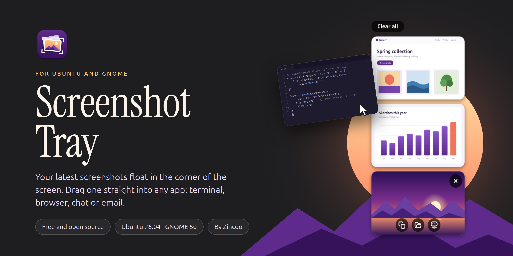
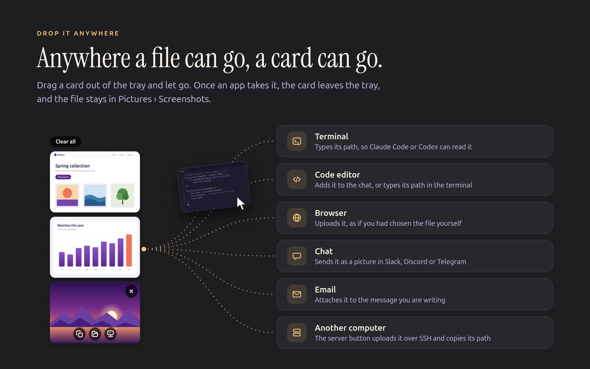
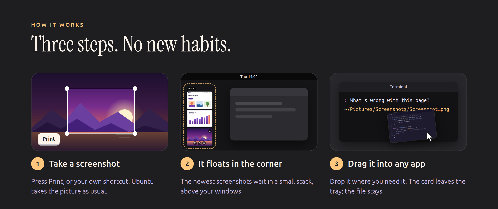
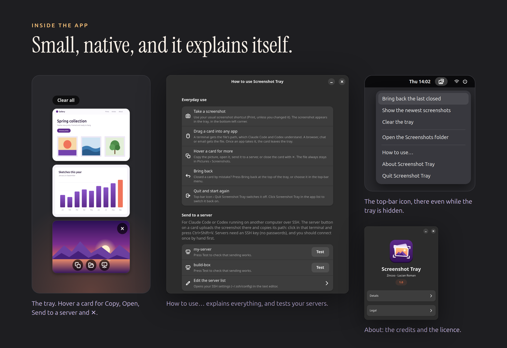
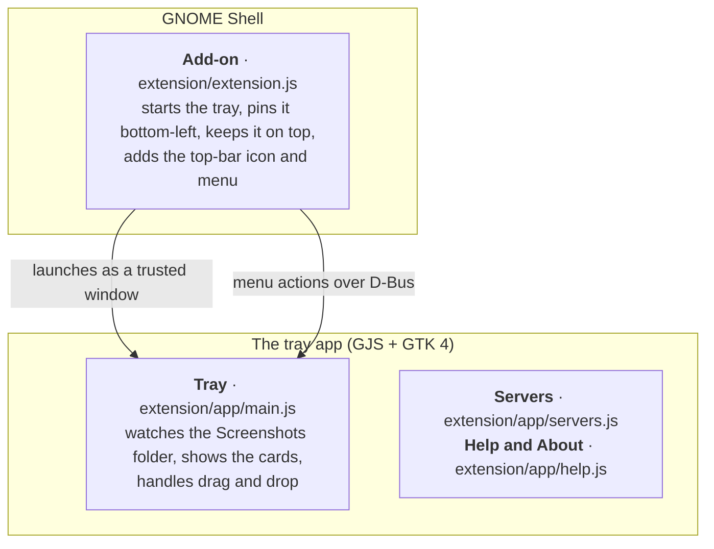

<p align="center">
  
</p>

<p align="center">
  <a href="LICENSE"></a>
  
  
  
</p>

<p align="center">
  <b>Screenshot Tray</b> keeps your latest screenshots floating in the corner of the screen,<br>
  so you can drag them straight into Claude Code, Codex, a browser, a chat or an email.<br>
  It's the floating stack known from CleanShot X on the Mac, for Ubuntu.
</p>

<p align="center">
  <a href="#install">Install</a> ·
  <a href="#how-it-works">How it works</a> ·
  <a href="#features">Features</a> ·
  <a href="#questions">Questions</a>
</p>

## Drop it anywhere



A card behaves like the screenshot file itself, so it goes anywhere a file can go. Once an
app accepts it, the card leaves the tray, and the file stays in *Pictures → Screenshots*.

## How it works



Screenshot Tray doesn't replace Ubuntu's screenshot tool. It watches the folder where
Ubuntu saves screenshots and shows each new one as a card.

## Install

You need **Ubuntu 26.04** (GNOME 50, Wayland). It has only been tested there; other
systems with GNOME 50 will probably work.

```bash
git clone https://github.com/romanlucian/screenshot-tray.git
cd screenshot-tray
./install.sh
```

Then **log out and back in once**, because GNOME loads new add-ons only at login. After
that the tray starts by itself, and its icon appears in the top bar.

> **Tip:** to paste a screenshot into Claude Code in a terminal with <kbd>Ctrl</kbd>+<kbd>V</kbd>
> instead of dragging it, install the clipboard helper: `sudo apt install wl-clipboard`.

## Features

| | |
|---|---|
| **Floating stack** | Each new screenshot appears in the bottom-left corner, above your windows. The 5 newest stay. |
| **Drag into any app** | A terminal gets the file's path; a browser, chat or email gets the file. |
| **Tidies itself** | A card leaves once an app accepts it. **Clear all** empties the tray, and it hides when empty. |
| **Bring back** | Closed a card by mistake? Bring it back from the tray or the top-bar menu. |
| **Send to a server** | For Claude Code or Codex on another computer: uploads the screenshot over SSH and copies its path there. |
| **Top-bar icon** | Reaches the tray even while it's hidden: bring back, clear, open the folder, help, quit. |
| **Built-in help** | *How to use…* explains everything in plain words, and tests your servers. |
| **Stays out of the way** | It never takes the keyboard, stays out of Alt+Tab and the dock, and is sharp on HiDPI screens. |
| **Safe** | It never deletes a screenshot, needs no `sudo`, and goes online only when you press *Send to a server*. |

## Inside the app



## Sending to a server

The server button on each card is for Claude Code or Codex running on another computer
over SSH. It uploads the screenshot to that computer and copies its path there: click in
that terminal and press <kbd>Ctrl</kbd>+<kbd>Shift</kbd>+<kbd>V</kbd>.

It sends to the servers on the `Host` lines of your `~/.ssh/config` (*How to use… → Edit
the server list* opens it), and it logs in the way scripts do, without ever asking for a
password. So it works with a **Linux or Mac server you reach with an SSH key**, such as a
cloud machine, a home server or a Raspberry Pi.

- **Connect once by hand first** (`ssh yourserver`), so your computer knows the server.
- **Password-only logins, logins that ask for a code (2FA) and Windows servers don't
  work.** If a send fails, the card says why in a plain sentence.
- **If Claude Code runs inside a container** on the server, share
  `~/.cache/screenshot-tray/inbox` with the container, or it won't see the file.

## What it adds to your computer

Everything goes in your own home folder. It needs no `sudo` and changes no system files.

| What | Where |
|---|---|
| The GNOME add-on, as a link to this folder | `~/.local/share/gnome-shell/extensions/screenshot-tray@zincoo.com` |
| Its entry in GNOME's list of add-ons | the setting `org.gnome.shell enabled-extensions` |
| The app's entry in the app list | `~/.local/share/applications/com.zincoo.ScreenshotTray.desktop` |
| The app's icon, as a link to `data/` | `~/.local/share/icons/hicolor/scalable/apps/com.zincoo.ScreenshotTray.svg` |
| The tray's note of which cards are showing, and which left | `~/.cache/screenshot-tray/cards.json` |
| On a server you send to: the screenshots you sent | `~/.cache/screenshot-tray/inbox/` (private to your account) |

## Uninstall

```bash
./uninstall.sh
```

This removes everything in the table above from this computer. Screenshots you sent stay
in that server's inbox folder, and your screenshots are never touched.

## Questions

<details>
<summary><b>Does it replace Ubuntu's screenshot tool?</b></summary>
<br>
No. Take screenshots exactly as before, with <kbd>Print</kbd> or your own shortcut.
Screenshot Tray only shows what Ubuntu saves.
</details>

<details>
<summary><b>Where do my screenshots go?</b></summary>
<br>
Where they always did: <i>Pictures → Screenshots</i>. Closing a card, clearing the tray
or dropping a card somewhere never deletes the file.
</details>

<details>
<summary><b>Why do I have to log out once after installing?</b></summary>
<br>
GNOME loads new add-ons only when you log in. After that one time, the tray starts by
itself with every login.
</details>

<details>
<summary><b>Does it send my screenshots anywhere?</b></summary>
<br>
Only when you press <i>Send to a server</i>, and then only to your own server over SSH.
Otherwise it never goes online.
</details>

<details>
<summary><b>How do I close it, and start it again?</b></summary>
<br>
Top-bar icon → <i>Quit Screenshot Tray</i>. It stays off, even after the next login,
until you click <b>Screenshot Tray</b> in the app list.
</details>

<details>
<summary><b>Why does it need a GNOME add-on?</b></summary>
<br>
On Wayland, GNOME doesn't let apps place their own windows or keep them on top; only the
desktop itself can. The small add-on does exactly that one job, and everything else is an
ordinary GTK app.
</details>

## For developers

<details>
<summary><b>How the pieces fit together</b></summary>
<br>



- The add-on starts the tray the same way Ubuntu's own desktop icons start their window
  (`ding@rastersoft.com`), so GNOME trusts it and lets the add-on place it. If the tray
  crashes 5 times in a row, the add-on leaves it off until the next login.
- **Without the add-on** (for example before the first log-out), the tray runs as an
  ordinary window: `gjs -m extension/app/main.js`. Drag it by its title bar, then
  right-click the title bar for *Always on Top*.
- **The README pictures** are designed from real parts of the app, which
  `tools/render-app-parts.sh` draws off-screen using the made-up demo screenshots in
  `tools/demo/` and a made-up server list. No real screenshot or setting of yours is ever
  published.
- About 1,100 lines of JavaScript. Built for GNOME 50: a newer GNOME may need the add-on
  updated.

</details>

## Credits

Made by [Zincoo](https://zincoo.com) · Lucian Roman

## License

Copyright © 2026 Lucian Roman, [Zincoo](https://zincoo.com).
Released under the [GPL-3.0-or-later](LICENSE).
